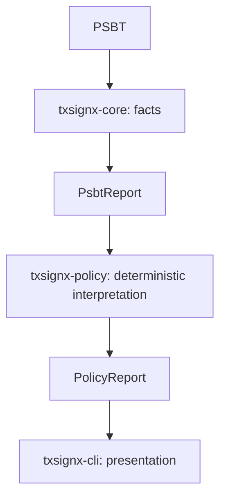

# TxSignX

**Inspect. Verify. Sign with Confidence.**

Bitcoin transaction security before signing.

TxSignX is an open-source Bitcoin transaction and PSBT security preflight engine
written in Rust. Milestone 1 implements raw-transaction inspection; Milestone 2
adds PSBT v0 inspection; Milestone 3 adds deterministic development policy
evaluation; Milestone 4 adds bounded public-descriptor wallet context. Node-backed
chain context remains a later milestone.

> TxSignX is under active development and is currently intended for development and Regtest testing. Do not rely on it to protect real Bitcoin funds.

## Milestone 1 — Raw transaction analysis

The reusable `txsignx-core` library decodes real Bitcoin consensus transaction
serialization with rust-bitcoin. `txsignx-cli` provides the `txsignx` binary.

Reports contain:

- TXID, wTXID, version, raw locktime, input/output counts, serialized byte size,
  weight in WU, virtual size in vB, witness presence, explicit RBF signaling,
  and checked total output value in integer satoshis.
- Each input's index, previous TXID/vout, sequence, scriptSig hex and byte length,
  explicit RBF signal, witness item count, and ordered witness items (index,
  byte length, lowercase hex). Empty witness items are preserved.
- Each output's index, integer satoshi value, scriptPubKey hex and byte length,
  and structural script classification.

Supported script types are **P2PKH, P2SH, P2WPKH, P2WSH, P2TR, OP_RETURN** and
**Unknown**. Classification uses rust-bitcoin's script helpers. Other script
forms, including bare P2PK, are currently Unknown. Classification does not
execute a script, validate a key, or prove an output can be spent.

## Build and use

Install stable Rust with rustfmt and Clippy. Verification used Rust/Cargo 1.95.0.
Run from this Rust workspace, `txsignx/txsignx/`:

```sh
cargo build -p txsignx-cli
./target/debug/txsignx --help
./target/debug/txsignx --version
./target/debug/txsignx tx inspect <RAW_TX_HEX>
./target/debug/txsignx tx inspect <RAW_TX_HEX> --json
```

Replace `<RAW_TX_HEX>` with your transaction. Runnable examples using the checked-in
public dummy fixtures:

```sh
LEGACY_TX=$(cat crates/txsignx-core/tests/fixtures/legacy.hex)
SEGWIT_TX=$(cat crates/txsignx-core/tests/fixtures/segwit.hex)
cargo run -p txsignx-cli -- tx inspect "$LEGACY_TX"
cargo run -p txsignx-cli -- tx inspect "$SEGWIT_TX"
cargo run -p txsignx-cli -- tx inspect "$SEGWIT_TX" --json
```

To install the binary on your Cargo bin path:

```sh
cargo install --path crates/txsignx-cli --locked
txsignx tx inspect "$LEGACY_TX" --json
```

Inputs must be contiguous ASCII hex, in either case. Empty input, whitespace,
`0x` prefixes, odd length, invalid hex, truncated consensus data, and trailing
bytes are rejected with typed core errors. Nothing is silently trimmed or
truncated. Command-line argument length is additionally constrained by the OS;
raw transaction input remains positional; PSBT input also supports file/stdin.

## JSON and library API

`--json` writes only the report to stdout. Errors go to stderr with a nonzero
exit status. Use `cargo run --quiet` to suppress Cargo's own stderr progress
messages, or invoke the compiled binary directly. Validate JSON with:

```sh
./target/debug/txsignx tx inspect "$SEGWIT_TX" --json | python3 -m json.tool
```

JSON uses deterministic snake_case fields, TXID strings, lowercase script and
witness hex, integer sequences and integer satoshi amounts. `fee_sats` is always
`null` in raw-only analysis. There is no network or address field. Consumers
must retain integer precision when parsing satoshi amounts and identifiers.

The core has no CLI formatting or I/O requirements:

```rust
use txsignx_core::{analyze_transaction, AnalysisError, TransactionReport};

fn inspect(raw_hex: &str) -> Result<TransactionReport, AnalysisError> {
    analyze_transaction(raw_hex)
}
```

`transaction::decode_transaction` is also available for bounded decoding into
a rust-bitcoin `Transaction`. The report API maps observations into primitive
values and serializable structures independently of rust-bitcoin's JSON types.

## Context and safety limits

**No network inference.** A raw transaction has no mainnet/testnet/signet/regtest
identifier. The analyzer does not infer a network or generate addresses.

**No raw-transaction fee calculation.** Inputs identify the previous outputs being spent, but
omit their values. Output totals alone cannot establish a fee or feerate.
Human output states `Fee: unavailable without prevout context`; JSON uses
`fee_sats: null`. PSBT inspection can use supplied prevout information for an absolute fee.
Wallet UTXOs and Bitcoin Core context remain future work.

**Explicit RBF only.** Under [BIP125](https://bips.dev/125/), an input signals
explicitly when `nSequence < 0xfffffffe`; the transaction signals if any input
does. Neither `0xfffffffe` nor `0xffffffff` signals explicitly. Inherited
signaling and actual node/mempool replacement policy require external context.
A report saying `Explicit RBF signaling: no` does not establish that a
transaction cannot be replaced.

**Bounded work.** Hex input is capped at 8,000,000 characters before decoding,
corresponding to 4,000,000 serialized bytes. Decoded transactions above 4,000,000
WU are rejected. These generous ceilings follow the
[BIP141 block-weight bound](https://bips.dev/141/); fitting the bound does not
establish that a transaction fits in a valid block or meets relay policy.

Structured reports additionally permit at most **100,000 witness items across
all inputs**. Empty items cost very few serialized bytes but expand into
individual report objects. This implementation resource limit is checked
before report construction, is not a consensus rule, and may reject unusually
large but consensus-decodable witnesses. `decode_transaction` enforces byte and
weight limits but does not build a report or apply this additional item limit.
No input is silently truncated. rust-bitcoin supplies consensus decoding and
its own defensive vector-allocation checks; TxSignX does not implement a second
consensus parser. Output totals use checked addition and reject `u64` overflow.

**Observation, not validation.** Successful decoding is not proof of full
consensus validity, standardness, correct signatures, available UTXOs, valid
amount ranges, finality, wallet ownership, absence of double spending, or safety
to sign. In particular, decoded amounts can exceed Bitcoin's money supply;
Milestone 1 reports them without claiming monetary validity. There is no script
execution, signing, private-key handling, live RPC, wallet, database, server,
or web integration. Raw inspection derives facts; policy evaluation is separate.

Raw scripts and witness data can contain identifying or sensitive data. The
requested report reproduces those bytes as hex. Review reports before sharing;
command-line arguments may also be visible in shell history or process listings.
TxSignX adds no transaction logging or network transmission. This milestone has
received implementation review and automated tests, not a professional audit.

## Milestone 2 — PSBT inspection

Supports **PSBT v0 / BIP174** using rust-bitcoin 0.32.102. PSBT v2 / BIP370
is unsupported and returns a typed unsupported-version error; it is a possible
future capability. No alternate PSBT parser or direct runtime dependency was
added. The existing bitcoin dependency enables its `base64` feature, adding
only the optional transitive base64 0.21.7 crate.

```sh
txsignx psbt inspect '<BASE64_PSBT>'
txsignx psbt inspect '<BASE64_PSBT>' --json
txsignx psbt inspect --file payment.psbt
txsignx psbt inspect --file payment.psbt --json
cat payment.psbt | txsignx psbt inspect --stdin
cat payment.psbt | txsignx psbt inspect --stdin --json
```

Choose exactly one source. All sources accept standard padded base64 text;
surrounding ASCII whitespace is trimmed, interior whitespace is rejected.
Binary PSBT, hex and URL-safe base64 are not auto-detected. File/stdin reads are
bounded and reject excess data without silent truncation. Prefer these sources
to keep the PSBT out of shell history and process arguments. Runnable dummy
examples use `fixtures/psbt-unsigned.b64` or `fixtures/psbt-partial.b64`:

```sh
./target/debug/txsignx psbt inspect --file fixtures/psbt-unsigned.b64
./target/debug/txsignx psbt inspect --file fixtures/psbt-partial.b64 --json | python3 -m json.tool
```

Library entry points are `txsignx_core::analyze_psbt(&str) ->
Result<PsbtReport, psbt::PsbtError>` and `psbt::decode_psbt(&str)` for an intact
rust-bitcoin PSBT. `transaction::analyze_decoded_transaction(&Transaction)`
shares the existing raw-transaction analysis with PSBT inspection. Raw report
fields and JSON remain unchanged.

PSBT JSON contains primitive values with snake_case field names. It includes
version/format, unsigned TXID, transaction version/locktime, input/output
counts, total output sats, explicit RBF, global xpub/unknown/proprietary counts,
`signing_state`, `fee`, `inputs` and `outputs`. Input records include outpoint,
sequence/RBF, UTXO source/consistency and resolved value/script facts, explicit
sighash numeric value/name (or null), ECDSA/Taproot signature counts/presence,
key-origin counts, script/final-marker presence and unknown/proprietary counts.
Outputs include the same value/script facts as raw analysis plus origin counts,
script presence, Taproot internal-key/tree presence and metadata counts.

**UTXO consistency.** Each input reports `missing`, `witness_utxo`,
`non_witness_utxo`, or `both` as its source. Status is `missing`, `valid`,
`txid_mismatch`, `vout_out_of_range`, or `witness_non_witness_mismatch`.
A supplied previous transaction must match the outpoint TXID and contain its
vout. When both forms exist, their value and scriptPubKey must agree. Invalid
context exposes no resolved value/script. `valid` means supplied metadata is
internally consistent; it does not authenticate chain membership or unspentness.
Witness-only context cannot be authenticated against a previous transaction.

**Absolute fee only.** After all UTXO consistency checks, rust-bitcoin's checked
fee helper subtracts the output sum from the input sum. JSON uses
`fee: {"status": "available", "fee_sats": 1000}` when computable. Otherwise
`fee_sats` is null and status is `missing_utxo_context`, `invalid_utxo_context`,
`negative_fee`, `overflow`, or `other_error`. Invalid context takes precedence
over missing context. Unsigned-transaction output-total overflow remains a
shared typed analysis error. Amounts are not checked for full consensus monetary
validity. A reported fee is conditional on supplied UTXO data. There is no
feerate field: the final script/witness size is not known, and unsigned vsize
is not a definitive fee-rate denominator.

**Structural signing state.** An input is `finalized` if either final scriptSig
or final scriptWitness is present, even if empty. Otherwise ECDSA partial
signatures, a Taproot key signature, or Taproot script signatures make it
`partially_signed`; absence of those fields makes it `unsigned`. Overall, all
unsigned inputs (including zero inputs) yield `unsigned`, signatures with no
finalized inputs yield `partially_signed`, all finalized yield `finalized`, and
finalized plus non-finalized inputs yield `mixed`. Final markers take precedence
over signatures. Signature presence is not signature validity, and finalization
markers do not establish broadcast readiness. Sighash is never guessed.

**PSBT resource limits.** Total decoded input is capped at **16 MiB**, normalized
base64 at **22,369,624 bytes**, and total text at **22,369,626 bytes** (allowing
CRLF at the full ceiling). These are application limits, not Bitcoin consensus
limits. A framing scan caps all maps and all key/value pairs at 100,000 each,
and the unsigned transaction field at 1,000,000 stripped bytes before semantic
parsing. Aggregate serialized output TapTree values are capped at **12,288
bytes**, bounding dependency tree expansion to at most 4,096 leaves before
allocation. This can reject unusually large valid trees. The dependency also
applies a 4,000,000-byte global-map reader limit and per-field decoder bounds.
The total PSBT is not subjected to the block-weight limit: tests accept large
metadata beyond 4 MB. The shared unsigned-transaction analysis retains its
transaction/report limits. Trailing data, malformed maps, duplicate keys,
truncated data and resource-limit violations fail without partial reports.

**Privacy and scope.** PSBTs can reveal transaction graphs, scripts, signatures,
xpubs, fingerprints and derivation paths. Reports include transaction and
resolved prevout scripts as lowercase hex; review reports before sharing.
Default reports expose counts/presence rather than xpub strings, public keys,
paths, signatures or proprietary/unknown contents. Parsing preserves those
fields internally; this is an inspector, not a sanitizer. Core errors and CLI
argument diagnostics omit full input and upstream privacy-bearing errors.
There is no PSBT logging, network inference, address generation, wallet ownership
claim, signature verification, signing, finalization, extraction, broadcasting,
node/wallet connection in inspection. The separate preflight command evaluates
Milestone 3 policies over these inspection facts.

See [synthetic fixture construction](fixtures/README.md), the
[implementation plan](docs/milestone-2-plan.md), and
[verification record](docs/milestone-2-verification.md).

## Milestone 3 — Deterministic development policy

`txsignx-policy` evaluates immutable `PsbtReport` facts from core and returns a
`PolicyReport`. The CLI owns input handling and presentation. Rules do not
reparse or modify PSBTs, access the network, use AI, consult time/randomness, or
make probabilistic decisions. Core has no dependency on policy. This separation
keeps the engine reusable for later API, React, Flutter FFI and wallet consumers.



Every finding includes a code, severity, title, factual message, recommendation
and global/input/output location. Policy reports include decision, risk level,
highest severity (null if none), count, ordered findings, evaluated rule codes,
applied configuration and a scope note. Rules expose metadata used directly by
`policy list`. Duplicate registry codes are rejected with typed errors.
Custom rule implementations are trusted application code and must honor the
read-only, deterministic, no-I/O rule contract.

Findings are ordered by rule registration, then global/input/output location
and index, with deterministic tie-breaks. The built-in registration order is
TG002, TG003, TG004, TG005, TG009, TG010, TG011, TG012, TG013, TG014. The same facts and
configuration produce the same policy JSON, without altering inspection facts.

| Highest finding severity | Decision | Risk level |
|---|---|---|
| None | PASS | Low |
| Info or Low | PASS | Low |
| Medium | REVIEW | Medium |
| High | REVIEW | High |
| Critical | BLOCK | Critical |

Risk categories come solely from the highest finding severity. There is no
accumulated or probabilistic score. PASS means **no currently evaluated active policy requires
review or blocking**; REVIEW means an active rule requires human review; BLOCK
means an active rule is critical/blocking. These are scoped policy outcomes,
not universal signing permissions or predictions of financial loss.

### Development thresholds

Defaults: `max_absolute_fee_sats = 100000`, `max_fee_ratio_bps = 1000` (10%).
These are **TxSignX development policy defaults**, not Bitcoin consensus limits,
Bitcoin Core relay policy, universal recommendations, or safety guarantees.

The fee share is **fee / total input value**, where total input value is total
outputs plus the available absolute fee. It is not fee divided by payment value,
and it is not a feerate. Comparisons use integer arithmetic only:

```text
fee_sats > max_absolute_fee_sats
u128(fee_sats) * 10000 >
    (u128(total_output_sats) + u128(fee_sats)) * u128(max_fee_ratio_bps)
```

Equality does not trigger either rule. Ratio limits range from 0 through 10,000
bps inclusive. Zero flags every nonzero fee share; zero fee / zero input value
produces no ratio finding. Widening before addition and multiplication handles
maximum u64 facts without overflow.

### Milestone 3 rules (wallet rules are described below)

| Code | Default severity | Trigger |
|---|---|---|
| TG002 | Critical | Available absolute fee exceeds configured satoshi limit |
| TG003 | Critical | Available fee share of total input value exceeds configured bps limit |
| TG009 | Critical | Input UTXO TXID mismatch, vout out of range, or disagreement between both UTXO forms |
| TG010 | High | Input previous-output context is missing |
| TG011 | High | Explicit numeric sighash differs from 0 (DEFAULT) or 1 (ALL) |
| TG012 | Info | Unknown/proprietary fields exist; one aggregate count-only finding |
| TG013 | Medium | Output or valid resolved prevout has an unrecognized script template |
| TG014 | Critical | An OP_RETURN output carries positive value |

TG009 concerns supplied PSBT metadata, not blockchain validity. Missing context
is reported by TG010 and is not itself a declaration of PSBT invalidity.
TG011 covers NONE, SINGLE and ANYONECANPAY combinations, and conservatively
requires review of other explicit numeric values; it does not assert they are
invalid. Absent explicit sighash is not guessed. Script-version compatibility
and signature validity are not checked. Unknown templates may be legitimate;
proprietary metadata is not automatically malicious. TG014 reflects the
provably unspendable output classification; zero-value OP_RETURN is not flagged.

When UTXO context is missing or invalid, TG002/TG003 emit no fabricated fee
findings; TG010/TG009 carry the corresponding reason. Mixed invalid and missing
inputs retain their separate input-scoped findings. Other fee failures
(`negative_fee`, `overflow`, `other_error`) stop preflight with a typed evaluation
error, **not PASS**, because no active rule describes those failures. Inconsistent
fee-state/value/context or map-count combinations are also rejected. Inspection
remains available separately to examine such facts.

### Commands and exit codes

```sh
txsignx policy list
txsignx policy list --json
txsignx psbt preflight '<BASE64_PSBT>'
txsignx psbt preflight '<BASE64_PSBT>' --json
txsignx psbt preflight --file payment.psbt
txsignx psbt preflight --file payment.psbt --json
cat payment.psbt | txsignx psbt preflight --stdin
cat payment.psbt | txsignx psbt preflight --stdin --json

txsignx psbt preflight --file payment.psbt \
  --max-absolute-fee-sats 50000 --max-fee-ratio-bps 500
```

The last command sets a 50,000-sat absolute limit and a 5% fee-share limit.
A filename requires `--file`; positional input is base64 text. Preflight reuses
Milestone 2's mutually exclusive, bounded input sources. Prefer file/stdin to
avoid shell history and process-argument exposure. Invalid configuration is
rejected before reading a file or waiting for stdin.

| Exit code | Meaning |
|---|---|
| 0 | Preflight PASS; or successful inspect/list/help/version |
| 1 | Input, configuration, argument, I/O or evaluation error |
| 2 | Preflight REVIEW |
| 3 | Preflight BLOCK |

A valid report is flushed before returning REVIEW/BLOCK, including in JSON mode.
Diagnostics go to stderr; input/evaluation errors produce no report. Argument
errors now consistently use 1 (earlier inspect versions used 2 for Clap errors),
so 2 unambiguously denotes REVIEW. Successful inspect behavior and JSON are
unchanged. Automation must handle 2/3 deliberately rather than treating every
nonzero exit as malformed JSON. For example:

```sh
status=0
txsignx psbt preflight --file fixtures/policy/800k-fee.b64 --json > report.json || status=$?
case "$status" in
  0|2|3) python3 -m json.tool report.json ;;
  *) exit "$status" ;;
esac
```

Preflight JSON is `{"inspection": {...}, "policy": {...}}`; it contains no raw
PSBT. `policy` includes `config` and `scope_note`. `policy list --json` contains
`active_rules` and `deferred_rules`, with required context and active flags.
Deferred metadata has no evaluator or assigned severity. Reports expose script
hex and transaction graphs, but not signatures, xpub strings, key origins, or
arbitrary metadata values. Findings use controlled text and observed numeric
facts; they do not reproduce arbitrary script/metadata text.

### Deferred scope and demonstrations

| Reserved code | Deferred rule | Required context |
|---|---|---|
| TG001 | Wrong Network | Explicit expected network / wallet context |
| TG006 | Immature Coinbase Input | Confirmations / chain height |
| TG007 | Dust Output | Explicit relay/dust assumptions or node policy |
| TG008 | Address Reuse | Wallet address/history |

These four rules remain deferred. Milestone 4 adds TG004/TG005 only when the
required caller-provided wallet context is available. Without it, wallet inputs
and expected change remain unchecked. Configured network does not establish
network truth. Confirmations, address reuse, coinbase maturity, mempool context
and cryptographic signatures remain unverified. No signing, finalization,
broadcasting or node integration is added.

The [public dummy policy fixtures](fixtures/policy/README.md) cover PASS, REVIEW,
BLOCK and evaluation errors. Run the capstone example:

```sh
./target/debug/txsignx psbt preflight --file fixtures/policy/800k-fee.b64
```

It reports 100,000 output sats and an 800,000-sat fee from 900,000 supplied input
sats. TG002 and TG003 are both Critical; decision is BLOCK, risk is Critical,
and exit status is 3. Additional fixtures isolate absolute fee, percentage fee,
missing/invalid UTXOs, unusual sighash, nonzero OP_RETURN and unknown scripts.
See the [Milestone 3 plan](docs/milestone-3-plan.md) and
[verification record](docs/milestone-3-verification.md).

## Milestone 4 — Descriptor-aware wallet context

Wallet mode asks whether supplied PSBT scripts match **caller-provided public
wallet descriptors within a bounded window**. It cannot establish on-chain UTXO
existence, synchronization, ownership of private keys, balances or confirmations.

```text
txsignx-core -> immutable PsbtReport
txsignx-wallet -> immutable WalletContextReport
txsignx-policy -> PolicyReport
txsignx-cli -> human or JSON output
```

The wallet crate depends on core and BDK Wallet 3.1.0 descriptor APIs; policy
reads wallet facts without deriving scripts. Core remains independent of BDK,
wallet and policy. No BDK Wallet or chain backend is instantiated. Wallet context
exists only in memory; no wallet database, cache or derivation state is saved.

### Wallet-aware preflight

```sh
cargo run -p txsignx-cli -- psbt preflight --file fixtures/wallet/payment.b64 \
  --external-descriptor-file fixtures/wallet/external.desc \
  --internal-descriptor-file fixtures/wallet/internal.desc \
  --network regtest --expected-change-output 1 --json
```

The public demo payment has an external input at index 7, an unmatched recipient
output, and internal change at index 3. It returns PASS/0 under development
thresholds. Replacing the PSBT file with `fixtures/wallet/change-hijack.b64`
returns TG005/CRITICAL/BLOCK and exit 3. `external-change.b64` returns TG005/HIGH/
REVIEW (2); `foreign-input.b64` and `collaborative.b64` return TG004/HIGH/REVIEW (2).
See [fixture details](fixtures/wallet/README.md).

Any wallet flag enables whole-configuration validation: external descriptor,
internal descriptor and explicit network are required. Direct
`--external-descriptor` / `--internal-descriptor` options are supported, each
mutually exclusive with its file option. Positional, `--file` and `--stdin` PSBT
sources remain supported. Invalid configuration/runtime errors return 1 with
empty stdout. Valid JSON is flushed before PASS/REVIEW/BLOCK exits 0/2/3.

**Prefer descriptor files.** Descriptors and xpubs reveal wallet activity and
relationships even though they cannot sign. Direct arguments may remain visible
in shell history and process listings. Errors and reports never repeat the
descriptors, xpubs, key origins, checksums or descriptor file contents. Reports
still expose the existing inspected transaction scripts and graph.

### Descriptor and derivation boundary

Only `Descriptor<DescriptorPublicKey>::from_str` parses descriptor input. Secret-
accepting string conversion / `parse_descriptor` is never used. Typed public
keys reject xprv/tprv, WIF and secret-key descriptor representations; test-only
dummy encodings cover rejection. Raw secret encodings are not an accepted input
format; valid public/x-only keys remain public keys. Parser/dependency errors
are mapped to static sanitized errors without source strings.

Both descriptors must be ranged, single-path and distinct. Hardened derivation
suffixes/wildcards are rejected (hardened origin metadata is permitted). Public
BIP32 derivation uses a fallible typed translator; exhausted depth and other
BIP32 errors cannot reach miniscript's definite-key panic assumptions. All
script collisions, including distinct descriptors that overlap, return an error.
There is no arbitrary external/internal preference.

`--network` accepts `bitcoin` (alias `mainnet`), `testnet`, `testnet4`, `signet`,
`regtest`. JSON emits the canonical configured name. BDK checks extended-key
main/test compatibility. Test-family prefixes do not distinguish their networks.
Neither PSBT nor script supplies a detected network; TG001 remains deferred.

`--derivation-window COUNT` defaults to **1000**, permits **1..=10000**, and derives
exactly indexes `0..COUNT` on each keychain: 999 is included at 1000; 1000 is not.
PSBT contents never expand the window. Additional denial-of-service limits are
64 KiB per descriptor (files read at most limit+1 bytes), 200,000 aggregate
key/path work units across the requested window, and 16 MiB derived script bytes.
Complex descriptors may therefore require a smaller window.

`NoMatchWithinWindow` means only that no matching script was found in that
window, **not** that a script universally does not belong to the wallet. Valid
resolved core prevouts are matched as External(index), Internal(index), or
NoMatchWithinWindow; missing/invalid core prevouts become Unavailable with a typed
reason. Outputs are classified from unsigned-transaction scripts. There are no
amount, position, address or script-type change heuristics.

### Explicit change, rules and schema

Repeat `--expected-change-output INDEX` for each intended change output. Indexes
are zero-based, must exist, and duplicates are rejected; reports sort them.
Ordinary recipient outputs need not match the wallet and are not TG005 findings.

| Rule | Trigger | Result |
|---|---|---|
| TG004 | Valid prevout with no descriptor match in the window | HIGH / REVIEW |
| TG005 | Declared change matches internal keychain | No finding |
| TG005 | Declared change matches external keychain | HIGH / REVIEW |
| TG005 | Declared change has no match in the window | CRITICAL / BLOCK |

TG004 does not duplicate missing TG010 or invalid TG009 context findings.
Foreign inputs can be legitimate in Payjoin/CoinJoin/multi-party transactions.
There are **10 active rules and 4 deferred rules** (TG001/TG006/TG007/TG008).

Wallet-aware JSON adds `wallet_context` alongside `inspection` and `policy`.
It includes `configured_network`, `derivation_window`, sorted
`expected_change_outputs`, `inputs` and `outputs`. Ownership is tagged with
`type`: `external` / `internal` plus `derivation_index`, `no_match_within_window`,
or `unavailable` plus `reason`. Each output has `expected_change`. The optional
wallet section is omitted entirely when no wallet context is supplied.

`policy.rule_evaluations` has one entry per active registered rule, with `code`,
`status` and optional typed `reason` (serialized as null when absent).
`evaluated_rules` is retained and includes fully or partially run rules, excluding
not-evaluated rules. Findings remain deterministic and ordered by registry then
location. Wallet facts are privately constructed and checked against the
inspection's transaction ID, ordered scripts and UTXO statuses before policy use.

| Rule/context | Status | Reason |
|---|---|---|
| TG004, all input context usable | evaluated | null |
| TG004, some input context unavailable | partially_evaluated | some_input_context_unavailable |
| TG004, no usable inputs | not_evaluated | no_usable_input_context |
| TG005, no explicit expected change | not_evaluated | no_expected_change_output |
| TG005, expected change provided | evaluated | null |
| TG004/TG005, no wallet context | not_evaluated | no_wallet_context |

Existing no-wallet preflight decisions and exit codes remain unchanged. PASS
means no currently evaluated active rule requires review or blocking; consult
scope and evaluation statuses. It never implies that skipped wallet checks,
network truth or chain state were verified. Human output displays the same
classifications, explicit change markers and evaluation statuses.

No signing, finalization, broadcast, network I/O, RPC, persistence, balances,
wallet history or chain synchronization is implemented. Milestone 5 will address
node-backed chain context separately. This is not a professional security audit.
See [design](docs/milestone-4-plan.md) and
[verification](docs/milestone-4-verification.md).

## Development verification

```sh
cargo fmt --check
cargo check --workspace --all-targets --all-features
cargo test --workspace
cargo clippy --workspace --all-targets --all-features -- -D warnings
cargo audit
```

After dependencies have been downloaded, `cargo test --workspace --offline`
runs without network access. Tests use public dummy legacy/SegWit fixtures,
independently computed hash and size expectations, the known genesis
transaction, script/RBF boundaries, all one- and two-byte inputs, deterministic
short malformed buffers, truncation/trailing checks, integer overflow and
resource limits, and real CLI process/JSON checks. No live RPC or private keys
are required. See [fixture notes](crates/txsignx-core/tests/fixtures/README.md).

## Roadmap

- [x] Milestone 1 — Raw transaction analysis
- [x] Milestone 2 — PSBT inspection
- [x] Milestone 3 — Deterministic policy engine
- [x] Milestone 4 — Descriptor wallet context
- [ ] Milestone 5 — Bitcoin Core / Regtest integration
- [ ] Milestone 6 — API/web integration and capstone polish

## Workspace boundaries

This repository contains `crates/txsignx-core`, `crates/txsignx-wallet`,
`crates/txsignx-policy`, and
`crates/txsignx-cli`.
The sibling [web application](https://github.com/j-kon/txsignx-web) and
[documentation](https://github.com/j-kon/txsignx-docs) are independent repositories.
The outer workspace is not a Git repository. Sibling `txsignx-brand/` remains
local only and must not be initialized, committed, or pushed.

Never commit `.env` files, RPC credentials, seed phrases, mnemonics, private keys,
extended private keys, wallet databases, or API tokens.
